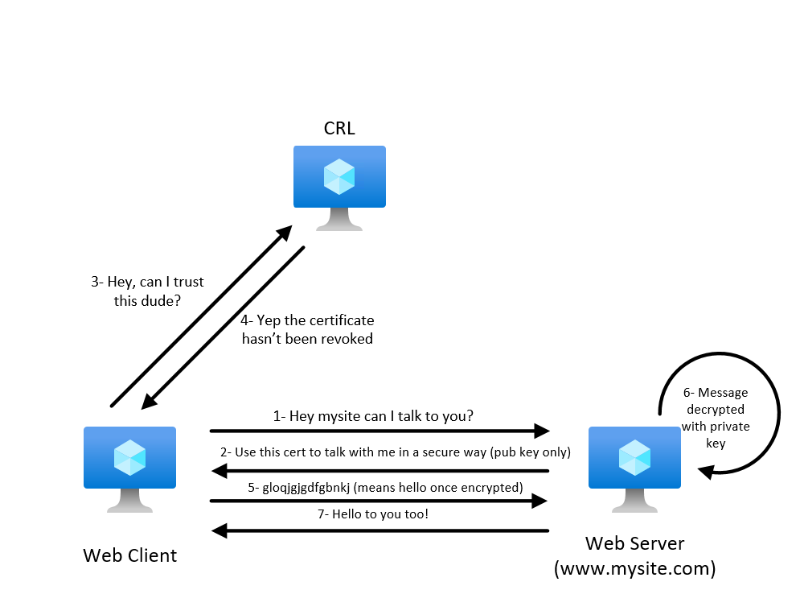
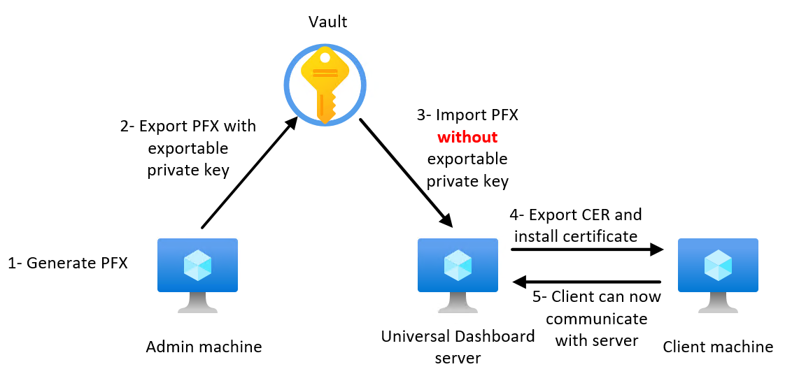
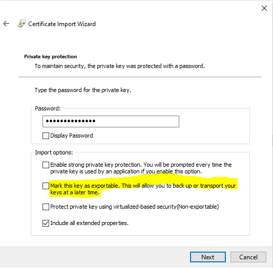

How to generate a self-signed certificate to make Universal Dashboard works (work with everything)
=============================

Even after almost 20 years in IT, I always find that working with certificate is painful because I don’t work with it on daily basis. Therefore, I’ve decided to write few lines to avoid having to look for tips for the next time. This document will be a 20000 feet overview of what SSL is and how you can implement a self-signed certificate correctly.

PS: if you don’t know Universal Dashboard module, I strongly recommend to take a look at this beautiful Powershell module.

# Table of content

1. [Vocabulary](#Vocabulary)
2. [How ssl works](#How_ssl_works)
3. [How to implement a self-signed certificate](#How_to_implement_a_self-signed_certificate)
4. [references](#references)

## Vocabulary <a name="Vocabulary"></a>

**Disclaimer**: I’m not an SSL guru, I really suck big time. This idea came after playing few hours with SSL certificate.

* **Private key**: Use to **decrypt** messages – **Should stay on your server** where you run your service
* **Public key**: Used to **encrypt** messages – This is what you **distribute to your clients** to be able to talk the same language.
* **Certificate Revocation List (CRL)**: public lists of certificates that has been revoked. **Self-signed certificate does not have CRL**. There is not just one CRL for all certificates, each authority must maintain his list, and so each certificate can have a different CRL endpoint.
* **PFX certificate**: A pfx is a certificate where you have both the public and private key protected by a password.
* **CER certificate**: A cer is a certificate where you only have the public key. You can distribute this file wihtout any issue.

## How ssl works <a name="How_ssl_works"></a>

Here a diagram that explain how SSL works:



## How to implement a self-signed certificate <a name="How_to_implement_a_self-signed_certificate"></a>

There is plenty of ways to create self-signed certificates, I’ve decided to use Powershell. To be able to do this, I will use my admin Windows 10 machine with RSAT installed. Then you should be able to have the PKI module where you have the New-SelfSignedCertificate cmdlet.

Here what we will do:



In a run as admin PS console:

``` Powershell
$cert = New-SelfSignedCertificate -dnsname <MyComputer>,<MyComputer>.<Mydomain> -notafter ($(get-date).AddYears(3)) -CertStoreLocation cert:\LocalMachine\My -Subject "CN=MyUDCert"
```

This will generate a new certificate which will expire in 3 years called MyUDCert into your LocalMachine\My Store.

Now let's export our certificate, for now I will store it on C:\TEMP but I recommend something better ;).

``` Powershell
$CertPassword = ConvertTo-SecureString -String "MyPassw0rd" -Force -AsPlainText
Export-PfxCertificate -Cert $cert -FilePath C:\TEMP\MyUDCert.pfx -Password $CertPassword
Export-Certificate -Cert $cert -FilePath C:\TEMP\MyUDCert.cer
```

To summarize, we now have the .pfx which contains both private and public keys. This cert must be stored safely, you will need it if something goes bad. We also have a .cer which contains the pubic key only. This is the file we will distribute to our client to be able to discuss with our server.

Now on **UD server**, you can import both pfx and cer certificates. You can put the pfx in the \LocalMachine\My but <span style="color:red">**make sure you don't make the private key exportable (check the picture below)!**</span> Doing this, you avoid malicious people to stole your "master" certificate. Now import your cer into the \LocalMachine\Root Store. Doing this, you tell your UD Server that the previous certificate can be trusted. If you check the certification path of the pfx, you shouldn't have any errors anymore.

Here how you make private key none exportable during import:



Now you can start your UD enpoint to listen ONLY on 443 if you do:

``` Powershell
$cert = ( Get-ChildItem -Path cert:\LocalMachine\My\<certificate thumbprint>)
Start-UDRestApi -Endpoint $Endpoint -port 443 -Certificate $cert
```

This part will be cover in another article.

Finally, you must import the cer (public key) into the \localMachine\Root or \CurrentUser\Root and now you should be able to discuss with your UD endpoint!

If we now summarize, we now have:

* A “vault” where you have the pfx with the private key exportable. This is your safety net if you need to regenerate a certificate for example.
* A UD Server where you have both a pfx and a cer. The pfx is located in My store where the private key is not exportable (no one can steal it) that UD will use to decrypt messages. And the cer which is located in \localMachine\Root to tell the computer that the previous cert is a legit one.
* A client that has a cer imported in \locamachine\Root or \CurrentUser\Root to tell the computer that if you want to discuss with the UD endpoint, this is the language you will talk.

## references <a name="references"></a>

* [CRL explanation](https://www.keycdn.com/support/certificate-revocation-list)
* [Add/Remove certificate on multiple OS](https://manuals.gfi.com/en/kerio/connect/content/server-configuration/ssl-certificates/adding-trusted-root-certificates-to-the-server-1605.html)
* [Certificate manipulation (OpenSSL)](https://support.ssl.com/Knowledgebase/Article/View/19/0/der-vs-crt-vs-cer-vs-pem-certificates-and-how-to-convert-them)